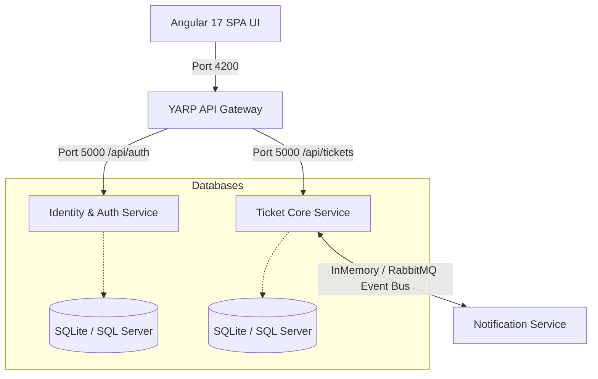

# ResolveDesk — Enterprise Microservices Customer Support Platform

ResolveDesk is a modern, high-fidelity customer support ticketing platform designed with **Clean Architecture** boundaries and a **Microservices Topology**. The solution is built with an ASP.NET Core backend (using .NET 8), YARP API Gateway, an Angular 17 frontend, and a self-healing dual database provider (SQLite/SQL Server) for portable, zero-install local executions.

---

## Architecture Overview

ResolveDesk is structured as a monorepo comprising five isolated services:



### 1. API Gateway (`ResolveDesk.Gateway`)
* **Technology**: YARP (Yet Another Reverse Proxy)
* **Responsibility**: Acts as the single entry point for all frontend requests, routing `/api/auth/*` traffic to the Identity Service and `/api/tickets/*` to the Ticket Core Service.
* **Port**: Runs on `http://localhost:5000`

### 2. Identity & Authentication Service (`ResolveDesk.Services.Identity`)
* **Technology**: ASP.NET Core Web API, ASP.NET Core Identity Core
* **Responsibility**: Manages user registration, role allocation (`Admin`, `SupportStaff`, `Customer`), password hashing, and generates signed HS256 JWT security tokens.
* **Database**: Runs on SQLite (`identity.db`) locally or SQL Server in production.
* **Port**: Runs on `http://localhost:5001`

### 3. Ticket Core Service (`ResolveDesk.Services.TicketCore`)
* **Technology**: ASP.NET Core Web API, Entity Framework Core, MassTransit
* **Responsibility**: Core domain microservice that manages ticket creation, status changes, priorities, SLA tracking, and ticket replies.
* **Event bus**: Publishes integration events (`TicketCreated`, `TicketStatusChanged`) via MassTransit.
* **Database**: Runs on SQLite (`tickets.db`) locally or SQL Server in production.
* **Port**: Runs on `http://localhost:5002`

### 4. Notification Service (`ResolveDesk.Services.Notification`)
* **Technology**: Worker Service / Console API
* **Responsibility**: Listens for integration events asynchronously and simulates email alerts or SMS notifications to support staff.
* **Port**: Runs as a background worker.

### 5. Angular UI Frontend (`ResolveDesk.UI`)
* **Technology**: Angular 17 (Standalone Components, Signals State Store, HttpClient, Tailwind CSS)
* **Responsibility**: A modern support dashboard displaying ticket statistics, priority breakdowns, interactive SLAs, and message boards.
* **Port**: Runs on `http://localhost:4200`

---

## Key Design Patterns & Engineering Highlights

### Clean Architecture (.NET Microservices)
Each service project is decoupled into logical boundaries to ensure business logic is isolated:
* **Core / Domain**: Holds entities (e.g. `Ticket`, `TicketResponse`), domain events, and interface definitions. Independent of libraries like EF Core.
* **Infrastructure**: Holds DbContext definitions, repository implementations, migration metadata, and event consumer implementations.
* **Web API / Presentation**: Registers dependencies, handles HTTP requests/routing, and applies filters.

### Dual-Database Provider Engine
The EF Core integration dynamically detects your database provider. If the connection string specifies a SQLite database (`.db`), EF switches to SQLite; otherwise, it resolves to SQL Server.
```csharp
var connectionString = builder.Configuration.GetConnectionString("DefaultConnection");
if (connectionString.Contains(".db") || connectionString.Contains("Data Source"))
{
    builder.Services.AddDbContext<ApplicationDbContext>(options =>
        options.UseSqlite(connectionString));
}
else
{
    builder.Services.AddDbContext<ApplicationDbContext>(options =>
        options.UseSqlServer(connectionString));
}
```

### Self-Healing Database & Seeding
To achieve a "plug-and-play" demo setup, the services use `context.Database.EnsureCreated()` on startup:
* If the database does not exist, it automatically compiles the database structure and writes all required tables immediately.
* It checks if the data tables are empty, and if so, seeds high-fidelity test records (roles, users, and tickets with reply threads) for the presentation dashboard.

### Decoupled Event-Driven Bus (InMemory / RabbitMQ)
MassTransit reads the event bus provider from configurations. In production container settings, it connects to RabbitMQ. For local demonstration environments, it initiates an **InMemory Loopback** bus that runs consumers in-process, removing any external broker dependencies.

### Angular 17 State Store with Signals
State management in the frontend avoids heavy third-party libraries like NgRx in favor of fine-grained **Angular Signals**:
* **Reactive State**: The `AuthService` exposes `currentUser` as a read-only Signal: `currentUser = signal<User | null>(null)`.
* **SLA Time Calculations**: Computed properties automatically recalculate SLA milestones when new ticket actions occur.
* **Interceptors**: An HTTP interceptor automatically appends the JWT bearer token to headers of outgoing requests.

---

## Local Presentation Quick Run

The workspace contains two portable launcher scripts that verify requirements, build the project assemblies, and execute all servers concurrently:

### Linux / macOS
```bash
# Set execution permission
chmod +x run-demo.sh

# Run the system locally
./run-demo.sh
```

### Windows (PowerShell)
```powershell
# Run the Powershell script
Set-ExecutionPolicy -ExecutionPolicy Bypass -Scope Process
.\run-demo.ps1
```

### Seeded Credentials
When the dashboard loads on **`http://localhost:4200`**, use any of the seeded credentials to log in:
* **Administrator**: `admin@resolvedesk.com` / `Admin@123`
* **Support Agent**: `support@resolvedesk.com` / `Support@123`
* **Customer**: `customer@resolvedesk.com` / `Customer@123`
