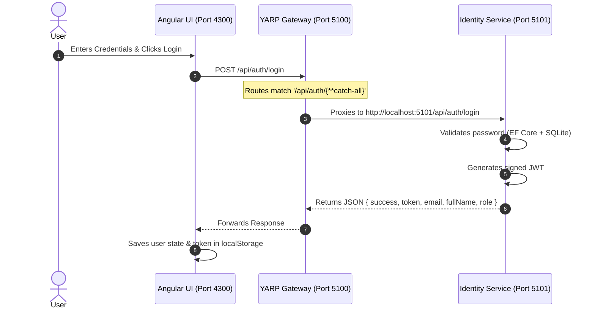
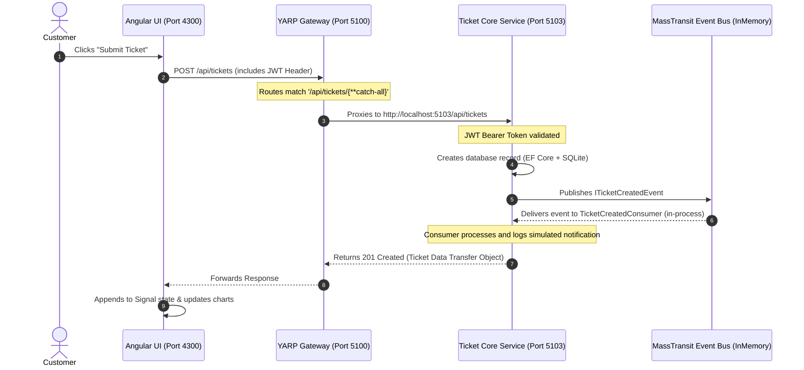

# ResolveDesk Code Flow Walkthrough

This document outlines the end-to-end execution flow of the **ResolveDesk** microservices application. We will trace two primary operations: **User Authentication (Login)** and **Creating a Support Ticket**.

---

## 1. User Authentication (Login Flow)

This flow tracks how a user logs in from the Angular frontend and receives a JWT security token.



### Detailed Code Reference (Login)
1. **Frontend Call**: In `auth.service.ts` (`src/ResolveDesk.UI/src/app/services/auth.service.ts`), the `login()` function sends a POST request:
   ```typescript
   private apiUrl = 'http://localhost:5100/api/auth';
   
   login(email: string, password: string): Observable<any> {
     return this.http.post<any>(`${this.apiUrl}/login`, { email, password }).pipe(...);
   }
   ```
2. **Gateway Routing**: In `appsettings.json` (`src/ResolveDesk.Gateway/appsettings.json`), YARP matches the `/api/auth/*` path and redirects to the Identity cluster:
   ```json
   "auth-route": {
     "ClusterId": "identity-cluster",
     "Match": { "Path": "/api/auth/{**catch-all}" }
   }
   ```
3. **Backend Processing**: The request lands on `AuthController` in `ResolveDesk.Services.Identity`. It checks the database:
   ```csharp
   var user = await _userManager.FindByEmailAsync(model.Email);
   if (user != null && await _userManager.CheckPasswordAsync(user, model.Password)) {
       var token = _tokenService.GenerateToken(user, roles);
       return Ok(new { success = true, token, email = user.Email, ... });
   }
   ```

---

## 2. Ticket Creation Flow

This flow tracks how a customer submits a ticket, how YARP proxies it to the Ticket Core Service, and how an asynchronous event is handled in memory.



### Detailed Code Reference (Ticket Creation)
1. **Frontend Call**: In `ticket.service.ts` (`src/ResolveDesk.UI/src/app/services/ticket.service.ts`):
   ```typescript
   private apiUrl = 'http://localhost:5100/api/tickets';
   
   createTicket(title: string, description: string, category: string, priority: string) {
     return this.http.post<Ticket>(this.apiUrl, { title, description, category, priority });
   }
   ```
2. **Gateway Routing**: In `appsettings.json` (`src/ResolveDesk.Gateway/appsettings.json`), the Gateway proxies `/api/tickets/*` to `http://localhost:5103`.
3. **Controller Handling**: In `TicketsController.cs` in `ResolveDesk.Services.TicketCore`, the endpoint validates the model, saves it to SQLite, and fires a publish event:
   ```csharp
   var ticket = new Ticket { ... };
   _context.Tickets.Add(ticket);
   await _context.SaveChangesAsync();

   // Publish event to MassTransit Bus
   await _publishEndpoint.Publish<ITicketCreatedEvent>(new {
       TicketId = ticket.Id,
       Title = ticket.Title,
       CustomerEmail = ticket.CustomerEmail
   });
   ```
4. **Asynchronous Consumer**: The bus routes `ITicketCreatedEvent` to `TicketCreatedConsumer.cs` (`src/ResolveDesk.Services.TicketCore/Consumers/TicketCreatedConsumer.cs`) in-memory:
   ```csharp
   public class TicketCreatedConsumer : IConsumer<ITicketCreatedEvent>
   {
       public async Task Consume(ConsumeContext<ITicketCreatedEvent> context)
       {
           // Simulates email notification sending
           _logger.LogInformation($"Notification: Ticket #{context.Message.TicketId} Created successfully.");
       }
   }
   ```

---

## 3. SLA Dynamic Recalculation Flow

In the frontend, whenever tickets are fetched or modified, statistics are computed on the fly using Angular Signals:

1. **State Store**: `dashboard.component.ts` (`src/ResolveDesk.UI/src/app/components/dashboard/dashboard.component.ts`) subscribes to the ticket list.
2. **Calculation Method**:
   ```typescript
   calculateStats() {
     // Compiles numbers of open/closed tickets
     this.totalTicketsCount = this.tickets.length;
     
     // Computes average resolution time (SLA)
     const resolved = this.tickets.filter(t => t.status === 'Closed' && t.resolvedAt);
     if (resolved.length > 0) {
       const totalHours = resolved.reduce((sum, t) => {
         const diff = new Date(t.resolvedAt).getTime() - new Date(t.createdAt).getTime();
         return sum + (diff / (1000 * 60 * 60));
       }, 0);
       this.averageResolutionHours = Math.round(totalHours / resolved.length);
     }
   }
   ```
3. **UI Binding**: The HTML renders category bar widths and priorities using dynamic directives (`[style.width.%]="item.percentage"`), ensuring a modern, reactive interface with zero external rendering dependencies.

---

## 4. Key Design Patterns in the Codebase

### A. Architectural & Structural Patterns
1. **Clean Architecture (Hexagonal / Ports & Adapters)**
   - **Where**: Backend microservice structure. 
   - **How**: Projects are divided into clear domain layers (e.g. `Ticket.cs` domain models), decoupled from infrastructure databases (`TicketDbContext.cs`) and endpoint presentation web APIs.
2. **API Gateway Pattern**
   - **Where**: `ResolveDesk.Gateway` project using YARP.
   - **How**: The Gateway exposes a single URL endpoint (`localhost:5100`) for the client UI, encapsulating the underlying microservices layout and forwarding requests transparently.

### B. Creational & Behavioral Patterns
1. **Dependency Injection (DI)**
   - **Where**: Registered globally in each service's `Program.cs` and injected into controllers/handlers.
   - **How**: ASP.NET Core natively resolves constructor parameters such as DbContext instances, MassTransit event publishers, or logging agents.
2. **Publish-Subscribe (Pub/Sub) Pattern**
   - **Where**: Event-driven coordination.
   - **How**: Decoupled messaging using MassTransit. When a ticket status changes, an integration event `ITicketStatusChangedEvent` is published, which matches and fires off registered consumers in memory.
3. **Repository Pattern**
   - **Where**: Abstracting database access contracts.
   - **How**: Controllers depend on contracts rather than concrete query drivers, facilitating mock testing and SQLite/SQL Server swapping.

### C. Frontend Patterns
1. **State Store Pattern (Reactive Signals)**
   - **Where**: `src/ResolveDesk.UI/src/app/services/auth.service.ts` and `dashboard.component.ts`.
   - **How**: Uses Angular 17's standalone Signals state to monitor current user context and trigger reactive computed DOM calculations instantly (e.g., ticket category/SLA metrics updating automatically without dirty checking).
2. **Intercepting Filter Pattern**
   - **Where**: `src/ResolveDesk.UI/src/app/interceptors/jwt.interceptor.ts`.
   - **How**: An HTTP interceptor intercepts every outbound API call to automatically attach authorization Bearer headers before dispatching, avoiding repetitive headers management.
